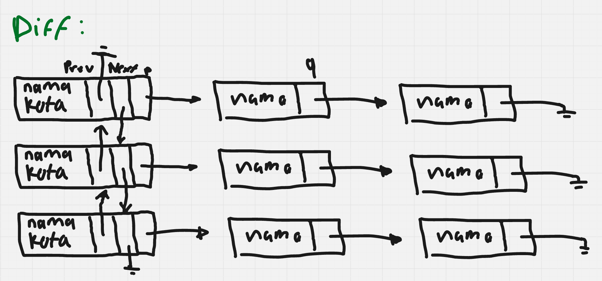

# LinkedList-to-LinkedList

## Tentang Program ADT ini
Akan diberi 5 opsi untuk dipilih, tentang basic dari `linked list` to `linked list`.\
Menggunakan studi kasus yang berupa `linked list` kota yang menunjuk ke `linked list` nama-nama orang\
dengan **opsi terdiri dari**:

### **1. Entry Data**
- Untuk Memasukkan nama kota baru atau nama orang
- Akan otomatis membuat nama kota baru jika tidak ada nama kota yang terdaftar
> **Info!**\
> Karena menggunaan `linked list` jadi tidak ada batasnya 
- Jika nama kota terdaftar, akan memunculkan input nama

### **2. Delete Nama** 
- Akan memunculkan semua data terlebih dahulu
> Contoh!\
> === DATA SAAT INI ===\
Bandung -> Amir -> Budi\
Jakarta -> Citra -> Dodi\
 ================
- Kemudian input nama yang akan didelete lalu mencari ke seluruh `linked list` (kota) dan `linked list` (nama)
- Jika terdapa nama yang sama di dua kota berbeda, maka dua-dua nya akan terdelete

### **3. Delete Kota**
- Akan memunculkan semua data terlebih dahulu
> **Contoh!**\
> === DATA SAAT INI ===\
Bandung -> Amir -> Budi\
Jakarta -> Citra -> Dodi\
 ================
- Kemudian input nama kota
- Semua `linked list` yang tertunjuk oleh kota itu akan juga terdelete
- jika `linked list` (kota) sebelumnya ada kota maka `prev` kota akan terhubung dengan `next` kota dari kota yang di delete
- jika `linked list` (kota) sebelumnya tidak ada kota maka kota dari `next` kota yang didelete, `prev` kotanya akan menjadi `null`
- jika `linked list` (kota) setelahnya tidak ada kota maka kota dari `prev` kota yang didelete, `next` kotanya akan menjadi `null`
> **Gambaran**\
> Delete `middle` kota:\
> kota: A <-> B <-> C\
> Delete B → next A menunjuk ke C, prev C menunjuk ke A
>
> Delete `first` kota:\
> kota: A <-> B\
> Delete A → Head menjadi B, prev B menjadi NULL
>
> Delete `last` kota:\
> kota: A <-> B\
> Delete B → Tail menjadi A, next A menjadi NULL

### **4. Tampilkan Data**
- Akan diberi dua opsi
> 1. Tampilkan Semua
> 2. Salah satu kota
- Jika memilih opsi 1, maka akan menampilkan semua data
- Jika memilih dua maka akan menampilkan kota yang sudah di input, beserta `linked list` yang tertunjuk

### **5. Keluar**
- Keluar dari program

## Lesson Learn
- Mengetahui bagaimana caranya sebuah `linked list` menunjuk ke sebuah `linked list`
- mengetahui `double linked list` 
- Mengetahui caranya Meng-search ke semua `linked list` dan `linked list` untuk mencari sebuah nama yang spesifik (menghiraukan upper dan lower case)
- Mengetahui Extern

## Penggambaran Awal Program
- hampir sama dengan array linked list yang membedakannya adalah visuaoisasinya

[Coretan Saya](https://miro.com/welcomeonboard/Mmp5aW5hR2NoQ2hFTzJ1NGZhSmpaUHJNdlUxelduUXYzWnRlTVg5RElSeEtRSE5zQ0Z5c0xpaFVRNG45WHpWWWtFUld6MVgzZ3FYV0Z5TDkxYUVJb3N4bHprU3RKV1RRYVJFNUZkUlVMWDVIZEpaZFVtRmVLOXRVYk93M0wvOCt0R2lncW1vRmFBVnlLcVJzTmdFdlNRPT0hdjE=?share_link_id=788633800719)

### **Referensi**
> https://github.com/KhuzaimaAwan47/Array-Implementation-of-Linked-List
> 
> https://github.com/ChrisRackauckas/LinkedLists.jl
>
> Deepseek

_**Note: Maap pak saya lupa ganti nama projectnya, masih case5.dev hehe..**_
